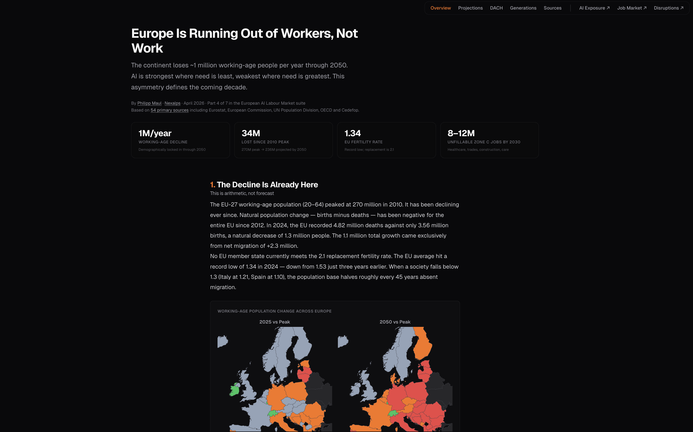

# Europe Is Running Out of Workers, Not Work

The workforce supply constraint that changes everything about the AI displacement narrative. Part 4 of 7 in the European AI Labour Market suite. Companion to the [AI Exposure Map](https://github.com/Ph1lM4/ai-job-impact-europe), [Job Market Map](https://github.com/Ph1lM4/job-market-europe), and [Disruptions Map](https://github.com/Ph1lM4/european-disruptions-map).

**What makes this different:** Most commentary treats AI displacement and demographic decline as separate stories. This project overlays them and shows the **structural mismatch**: AI substitutes best where retirement pressure is lowest (Zone A, clerical), and worst where retirement pressure is severe (Zone C, healthcare and trades). The EU-27 will lose ~1.3 million working-age people per year through 2050 — and AI can fill the wrong gap.



## Live Site

**[demographics.nexalps.com →](https://demographics.nexalps.com)** *(static site, no backend)*

## What's Included

| Page | Description |
|------|-------------|
| [Overview](https://demographics.nexalps.com/) | Thesis, AI substitution matrix (Zones A–D), five asymmetries, fertility collapse, choropleth pair (2025 vs 2050) |
| [Projections](https://demographics.nexalps.com/projections.html) | EUROPOP2023 through 2050 — working-age decline, dependency ratios, age pyramid, **historical precedents** (Japan, China, Baltic, France, Black Death), fiscal impact |
| [DACH](https://demographics.nexalps.com/dach.html) | Germany, Austria, Switzerland — 163 Engpassberufe, 82% of Austrian firms reporting shortages, 34.4% foreign workforce in Switzerland |
| [Generations](https://demographics.nexalps.com/generations.html) | Four generational crises, immigration arithmetic, political constraints (post-April 2026), retraining impossibility |
| [Sources](https://demographics.nexalps.com/sources.html) | 54 primary sources with tier ratings |
| [llms.txt](https://demographics.nexalps.com/llms.txt) | Machine-readable project summary |

## Key Findings

- EU-27 working-age population (20–64) **peaked at 270M in 2010**, projected to fall to **236M by 2050** — a loss of 34 million, or about 1.3 million workers per year
- EU fertility rate hit a **record low of 1.34 in 2024**; no member state meets the 2.1 replacement rate
- **8–12 million Zone C positions** (healthcare, trades, care) projected unfillable by 2030; AI substitutes at most 5–15% of these tasks
- Old-age dependency ratio shifts from **1 retiree per 3 workers to 1 per 2 by 2050** (UN WPP 2024: 2.87 → 1.86)
- Without migration, the EU population would fall to **387M by 2050** (vs 448M baseline) — a 60M gap
- Germany needs **400,000+ net migrants annually**; 2024 net EU migration turned negative
- **Cross-zone retraining** (cognitive → physical) has no historical precedent and faces a 3% annual switching-rate ceiling
- **Entry-level tech hiring in Europe collapsed 73% year-over-year** (Gen Z structural exclusion) — cross-verified by the Job Market Map
- Italy: **−17.5% working-age by 2050**, Spain −12.9%, Germany −12.0%
- France (TFR 1.61) is the EU's only relative outlier with organic stabilisation possible

## The AI Substitution Matrix

| Zone | Workers | AI capacity | Retirement gap by 2030 | Verdict |
|------|---------|-------------|------------------------|---------|
| **A — High AI exposure** | 25–30M (clerical, admin) | 60–80% of tasks | ~3.5M | Surplus displacement — AI replaces faster than retirement creates gaps |
| **B — Medium AI** | 40–50M (software, marketing, HR) | 20–35% of tasks | ~5M | Partial offset — AI transforms roles, genuine shortage in strategic positions |
| **C — Low AI** | 90–100M (healthcare, trades, care) | 5–15% of tasks | ~12M | **Critical gap** — AI cannot compensate for 8–12M retirees by 2030 |
| **D — AI-enhanced demand** | 3–5M (AI/ML, data, cybersecurity) | Demand creation | ~0.25M | Chronic undersupply — EU has 10M ICT specialists, needs 20M by 2030 |

## Historical Precedents

Five comparables for what happens when a society's workforce shrinks faster than it can replace:

| Case | When | Driver | What helped recovery |
|------|------|--------|----------------------|
| **Japan** | 1995–2025 | Aging + near-closed immigration | Extended retirement age (partial), female participation (partial), late immigration (2019+). Robots and pronatalism failed. 30 years of GDP stagnation |
| **China** | 2015–present | One-child legacy + fertility 1.00 | Three-child policy (2021), provincial subsidies. Too early to judge; no migration lever available |
| **Baltic + Bulgaria** | 1990–2025 | Low fertility + mass EU emigration | Wage convergence produced some return migration post-2015; diaspora incentives failed. Bulgaria −29%, Latvia −28% |
| **France** | 1800–1940, then recovery | First mover below replacement (1870s) | Century-long pronatalism + post-colonial migration. TFR recovered to 1.61 (EU highest) — took 100 years |
| **The Black Death** | 1348–1353 | Mortality shock (30–50% dead) | Nothing intentional — wages tripled, serfdom collapsed, wage labour emerged. Structural reorganisation, not managed adjustment |

## The Four Generational Crises

- **Boomers (62–80):** Knowledge exodus. Only 29% of organisations have retirement-forecast knowledge-transfer plans
- **Gen X (46–61):** Frozen middle. Only 12% plan professional development (vs 26% Gen Z)
- **Millennials (30–45):** Maximum AI exposure but highest adaptive capacity. 62% claim AI expertise
- **Gen Z (14–29):** Structurally excluded. −73% entry-level hiring, 15.1% youth unemployment

## Tech Stack

- **Pure HTML/CSS/JavaScript** — no framework, no build step
- **D3.js v7** for interactive charts (choropleth maps, age pyramid, dependency ratio, country divergence)
- **PostHog** for privacy-friendly analytics (EU-hosted)
- **Netlify** for hosting with security headers and caching (`netlify.toml`)
- **Geist** font from Google Fonts

## The Suite

This is Part 4 of 7 in the European AI Labour Market suite:

1. **[AI Exposure Map](https://ai-exposure.nexalps.com)** — AI exposure scores for ~130 occupation groups × 36 countries (*which jobs AI hits*)
2. **[Job Market](https://job-market.nexalps.com)** — Hiring trends and career intelligence across 9 roles × 34 countries (*where demand is going*)
3. **[Disruptions](https://disruptions.nexalps.com)** — 580 years of technology shocks, 20 case studies, 5 disruption patterns (*what happened every other time*)
4. **[Demographics](https://demographics.nexalps.com)** — Population × AI substitution through 2050 *(this repo — the structural constraint)*
5. *Coming soon — Reskilling*
6. *Coming soon*
7. *Coming soon*

**How the four products connect:**

- `ai-exposure.nexalps.com` = **which jobs** AI hits
- `job-market.nexalps.com` = **where demand** is going
- `disruptions.nexalps.com` = **what happened every other time**
- `demographics.nexalps.com` = **the structural constraint** (population decline × AI mismatch)

ISCO-08 codes bridge all four products. Shared design system (shadcn dark, Geist font, `#f97316` orange accent).

## Preview Locally

```bash
cd site && python3 -m http.server 3847
# Open http://localhost:3847
```

## Data Sources

54 primary sources across 3 tiers. Full bibliography at [demographics.nexalps.com/sources.html](https://demographics.nexalps.com/sources.html).

| Tier | Definition | Examples |
|------|------------|---------|
| Tier 1 | Official statistics or peer-reviewed | Eurostat (demo_pjan, demo_gind, proj_23np, demo_frate), UN WPP 2024 (Demographic Indicators + Probabilistic Projections), IMF WEO Database, Destatis, Statistik Austria, BFS, OECD Economic Surveys (EU 2025, Japan 2024, China 2022, Switzerland 2024), INED, National Bureau of Statistics of China, European Commission 2024 Ageing Report |
| Tier 2 | Institutional reports with documented methodology | Bruegel, Bundesagentur für Arbeit (Engpassanalyse), AMS, WKO, Bitkom, BIBB, Ravio, Michael Page, Malteser, Allianz Research, ELA/EURES, IW Köln, CEPR |
| Tier 3 | Historical scholarship and expert analysis | Ole J. Benedictow (*The Black Death 1346–1353*), Gregory Clark (*A Farewell to Alms*), John H. Munro (Black Death wages and prices, MPRA), Claridge & Delabastita (LSE), Anne H. Gauthier (*Family Policies in Industrialized Countries*, 2002) |

Raw source PDFs and CSVs used during research are organised in `data/` by theme (`data/un/`, `data/oecd/`, `data/eurostat/`, `data/germany/`, `data/austria/`, `data/switzerland/`, `data/historical/`, `data/imf/`). The `data/` folder is excluded from the repo via `.gitignore` to keep clones lean — original sources are public and linked in [sources.html](https://demographics.nexalps.com/sources.html).

## Methodology

1. **Projection anchor.** Eurostat EUROPOP2023 baseline for EU-27 working-age and total population through 2050. UN WPP 2024 for cross-country comparisons (Japan, China) and dependency-ratio validation.
2. **AI substitution matrix.** Occupations grouped into four zones (A–D) by AI task-substitution share (0–10 scale from the AI Exposure Map, ISCO-08 3-digit) cross-referenced with retirement pressure from population-by-age-cohort data.
3. **Country divergence taxonomy.** Three tiers — sharpest decline (Italy, Spain, Bulgaria), moderate decline (Germany, Poland), relative resilience (France, Ireland, Switzerland) — based on EUROPOP2023 working-age projections plus migration baselines.
4. **Historical comparables.** Five cases chosen to span mechanism diversity (aging alone, aging + emigration, fertility collapse + policy response, mortality shock). Each coded on status-at-the-time and what-helped-recovery dimensions.
5. **DACH depth.** Germany, Austria, Switzerland treated in detail because they are Phil's operating context and the clearest examples of three different policy responses to a shared demographic threat (immigration liberalisation, corporatist retraining, wage-premium magnetism).

Unlike the AI Exposure Map (which scores occupations via Claude) or the Job Market Map (which reports current hiring), this product is **research-authored synthesis**. The data file (`site/demographics-data.json`) is hand-curated from cited primary sources. No scraping pipeline, no scoring script.

## License

**Dual-licensed:**

- **Code** (`site/*.html`, `site/*.js`, `site/*.css`): MIT (see `LICENSE-CODE`)
- **Analysis and structured data** (`site/demographics-data.json`, case narratives, taxonomy): CC-BY 4.0 (see `LICENSE-DATA`) — © Philipp Maul - Nexalps

Built on academic and institutional research cited throughout; see [Sources](https://demographics.nexalps.com/sources.html) and `LICENSE-DATA` for upstream source licensing.

## Author

Built by [Philipp Maul](https://www.linkedin.com/in/pmaul/) at [Nexalps](https://nexalps.com).

## Contributing

Issues and PRs welcome. Additional historical comparables, corrections to cited figures, or extensions of the AI substitution matrix to non-DACH European regions especially appreciated. If you refine a country-level projection using a newer Eurostat vintage, please share back.
